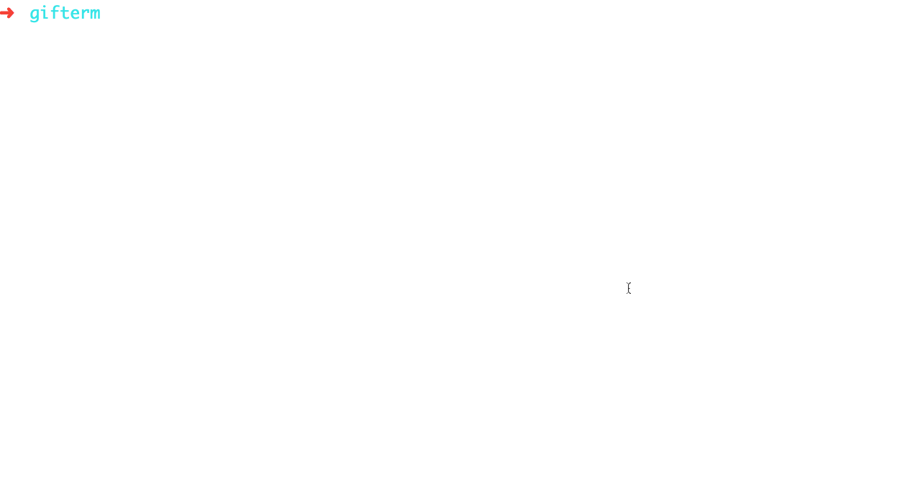

# gifs in your terminal. because why not?
- - -



## installation & setup

```
gem install gif
gif --setup
gif [SEARCH_TERM] [-loops NUM_LOOPS] [--modern] [--setup] [--help]
```
- - -

## usage

**NOTE**: this works best when used with **iTerm**. OSX's built in Terminal doesn't refresh fast enough. Also, the gifs you play will expand to the size of your terminal window. So the bigger your iTerm window (and the more zoomed out you are!), the higher quality the gif will be.

`gif` will play a random gif in your terminal

`gif [search_terms]` will filter by search terms - `gif pikachu` will cause you to immediately feel 100% happier.

`--modern` will give you a much better image resolution, but only works if you have iTerm 2.9 or higher and NPM installed.

`--loops` or `--l` will let you loop the gif - `gif pikachu --loops 10` will cause you to immediately feel 1000% happier.

`--help`, `--h`, or `man` will print this paragraph.

If you have iTerm 2.9 or greater and NPM installed, you should add this line to your bash_profile, fish_config, or whatever other shell config you use - `export MODERN_TERMINAL="true"`. This will do the same thing as passing the --modern flag to all your `gif` commands.
- - -

## problems

you need to have **Ruby**, **RubyGems**, and **Homebrew** installed. **NPM** is required if you want better image resolution.

some gifs (especially without the --modern flag) will look pretty funky in your terminal. this can happen if they cannot be unoptimized by gifsicle.

essentially, many gifs are stored where each frame is a diff. gifsicle can try to turn these diffs into full frames (a process known as unoptimization), but sometimes cannot do this due to complicated color palettes, transparency issues, etc.

please file an issue or PR if you think you can address either of these problems (or anything else you run into)!
- - -
that's all there is to it, folks.

:computer: happy giffing! :computer:
